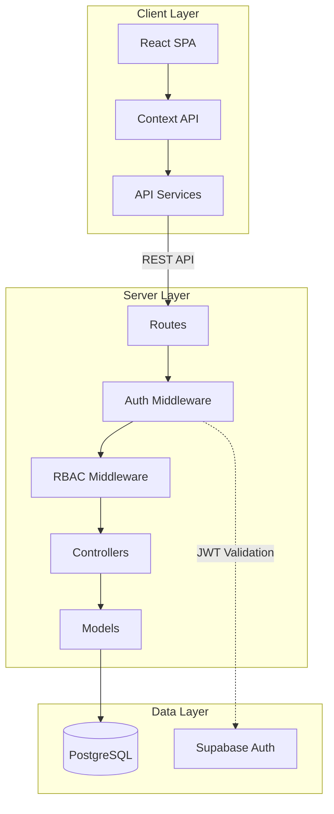

# OneFlow – Plan to Bill in One Place

A modular Project Management and Billing system that enables teams to manage projects end-to-end: from Planning through Execution, Timesheets, Billing, and Profit Tracking—all in one unified platform.

---

## Table of Contents

- [Problem Statement](#problem-statement)
- [Solution Overview](#solution-overview)
- [Key Features](#key-features)
- [User Roles and Permissions](#user-roles-and-permissions)
- [System Architecture](#system-architecture)
- [Tech Stack](#tech-stack)
- [Data Flow](#data-flow)
- [Folder Structure](#folder-structure)
- [API Design Overview](#api-design-overview)
- [Example Use Case](#example-use-case)
- [Installation and Setup](#installation-and-setup)
- [Environment Variables](#environment-variables)
- [Future Enhancements](#future-enhancements)
- [Why This Project Matters](#why-this-project-matters)
- [License](#license)

---

## Problem Statement

Organizations managing client projects face fragmented workflows across multiple disconnected tools:

- **Project planning** lives in one tool (Jira, Asana, Trello)
- **Time tracking** requires another application (Toggl, Harvest)
- **Invoicing and billing** happens in separate accounting software (QuickBooks, Xero)
- **Expense management** is often handled via spreadsheets or yet another system
- **Profitability analysis** requires manual data aggregation from all sources

This fragmentation leads to:
- Data silos and inconsistent information
- Manual reconciliation efforts and human errors
- Delayed invoicing and cash flow issues
- Inability to track real-time project profitability
- Poor visibility for stakeholders across departments

---

## Solution Overview

OneFlow consolidates the entire project lifecycle into a single, integrated platform:

```
┌─────────────────────────────────────────────────────────────────────┐
│                           OneFlow Platform                          │
├─────────────┬─────────────┬─────────────┬─────────────┬────────────┤
│   Planning  │  Execution  │  Timesheets │   Billing   │  Analytics │
├─────────────┼─────────────┼─────────────┼─────────────┼────────────┤
│  Projects   │    Tasks    │   Hours     │  Invoices   │  Revenue   │
│  Milestones │   Assign    │  Billable   │  Purchases  │  Costs     │
│  Budgets    │   Track     │  Expenses   │  Orders     │  Margins   │
└─────────────┴─────────────┴─────────────┴─────────────┴────────────┘
```

OneFlow provides a unified data model where every timesheet entry, expense, and invoice links directly back to the originating project and task, enabling real-time profitability tracking and streamlined operations.

---

## Key Features

### Project Management

- Create and manage projects with defined budgets, timelines, and billing types
- Support for Fixed-Price, Time & Materials, and Retainer billing models
- Milestone tracking with progress indicators
- Team member assignment with role-based visibility
- Project status lifecycle management (Draft, In Progress, On Hold, Completed, Cancelled)

### Task and Timesheet Management

- Hierarchical task breakdown with parent-child relationships
- Task assignment to individual team members or groups
- Customizable task states and workflow transitions
- Time entry logging with billable/non-billable classification
- Timesheet approval workflows
- Automatic calculation of logged hours per task and project

### Billing and Finance

| Module | Description |
|--------|-------------|
| **Sales Orders** | Create and manage client sales orders linked to projects |
| **Customer Invoices** | Generate invoices from approved timesheets and milestones |
| **Purchase Orders** | Track vendor purchases and subcontractor costs |
| **Vendor Bills** | Record and manage incoming bills against projects |
| **Expenses** | Log project expenses with receipt attachments and billable flags |

### Analytics and Reporting

- Real-time project profitability dashboards
- Revenue vs. cost tracking per project
- Margin analysis and forecasting
- Resource utilization reports
- Timesheet summaries by employee, project, or date range
- Exportable reports for accounting integration

---

## User Roles and Permissions

| Role | Projects | Tasks | Timesheets | Invoices | Expenses | Purchases | Analytics |
|------|----------|-------|------------|----------|----------|-----------|-----------|
| **Admin** | Full Access | Full Access | Full Access | Full Access | Full Access | Full Access | Full Access |
| **Project Manager** | Create, Edit, View | Full Access | Approve, View | View | Approve, View | Create, View | Project-level |
| **Team Member** | View Assigned | View, Update Assigned | Create Own, View | None | Create Own | None | Own Data |
| **Finance/Sales** | View | View | View | Full Access | View, Approve | Full Access | Full Access |

### Permission Details

- **Full Access**: Create, Read, Update, Delete
- **Approve**: Review and approve/reject submissions
- **View Assigned**: Access only to projects/tasks explicitly assigned
- **Own Data**: Access limited to self-created records

---

## System Architecture

### High-Level Architecture

OneFlow follows a modern three-tier architecture with clear separation of concerns:

```
┌────────────────────────────────────────────────────────────────────────┐
│                              Client Layer                              │
│  ┌──────────────────────────────────────────────────────────────────┐  │
│  │                    React SPA (TypeScript)                        │  │
│  │  ┌─────────┐ ┌─────────┐ ┌─────────┐ ┌─────────┐ ┌─────────┐    │  │
│  │  │Dashboard│ │Projects │ │  Tasks  │ │Invoices │ │ Reports │    │  │
│  │  └─────────┘ └─────────┘ └─────────┘ └─────────┘ └─────────┘    │  │
│  └──────────────────────────────────────────────────────────────────┘  │
└────────────────────────────────────────────────────────────────────────┘
                                    │
                                    │ HTTPS / REST API
                                    ▼
┌────────────────────────────────────────────────────────────────────────┐
│                             Server Layer                               │
│  ┌──────────────────────────────────────────────────────────────────┐  │
│  │                   Node.js / Express (TypeScript)                 │  │
│  │  ┌──────────┐ ┌──────────┐ ┌──────────┐ ┌──────────┐            │  │
│  │  │   Auth   │ │   RBAC   │ │Controllers│ │  Models  │            │  │
│  │  │Middleware│ │Middleware│ │          │ │          │            │  │
│  │  └──────────┘ └──────────┘ └──────────┘ └──────────┘            │  │
│  └──────────────────────────────────────────────────────────────────┘  │
└────────────────────────────────────────────────────────────────────────┘
                                    │
                                    │ SQL / Supabase Client
                                    ▼
┌────────────────────────────────────────────────────────────────────────┐
│                             Data Layer                                 │
│  ┌──────────────────────────────────────────────────────────────────┐  │
│  │                    PostgreSQL (Supabase)                         │  │
│  │  ┌─────────┐ ┌─────────┐ ┌─────────┐ ┌─────────┐ ┌─────────┐    │  │
│  │  │Projects │ │  Tasks  │ │Timesheets│ │Invoices │ │Expenses │    │  │
│  │  └─────────┘ └─────────┘ └─────────┘ └─────────┘ └─────────┘    │  │
│  └──────────────────────────────────────────────────────────────────┘  │
└────────────────────────────────────────────────────────────────────────┘
```

### Architecture Diagram (Mermaid)



---

## Tech Stack

### Frontend

| Technology | Purpose |
|------------|---------|
| React 18 | UI framework with hooks and functional components |
| TypeScript | Type-safe JavaScript for maintainable code |
| Vite | Fast build tool and development server |
| Tailwind CSS | Utility-first CSS framework |
| React Router | Client-side routing |
| Context API | State management |

### Backend

| Technology | Purpose |
|------------|---------|
| Node.js | JavaScript runtime |
| Express.js | Web application framework |
| TypeScript | Type-safe server code |
| Swagger/OpenAPI | API documentation |

### Database

| Technology | Purpose |
|------------|---------|
| PostgreSQL | Primary relational database |
| Supabase | Database hosting, real-time subscriptions, and auth |

### Authentication

| Technology | Purpose |
|------------|---------|
| Supabase Auth | User authentication and session management |
| JWT | Stateless token-based authorization |
| RBAC | Role-based access control middleware |

### DevOps (Optional)

| Technology | Purpose |
|------------|---------|
| Docker | Containerization |
| GitHub Actions | CI/CD pipelines |
| Vercel/Railway | Frontend/Backend deployment |

---

## Data Flow

The following diagram illustrates how data flows through the system from project creation to analytics:

```
┌──────────────┐
│   PROJECT    │
│  Created by  │
│   Manager    │
└──────┬───────┘
       │
       ▼
┌──────────────┐     ┌──────────────┐
│    TASKS     │────▶│  ASSIGNMENTS │
│  Breakdown   │     │  Team Members│
└──────┬───────┘     └──────────────┘
       │
       ▼
┌──────────────┐     ┌──────────────┐
│  TIMESHEETS  │────▶│   EXPENSES   │
│ Hours Logged │     │   Incurred   │
└──────┬───────┘     └──────┬───────┘
       │                    │
       ▼                    ▼
┌──────────────────────────────────┐
│           BILLING                │
│  ┌──────────┐    ┌──────────┐   │
│  │  Sales   │    │ Purchase │   │
│  │  Orders  │    │  Orders  │   │
│  └────┬─────┘    └────┬─────┘   │
│       ▼               ▼         │
│  ┌──────────┐    ┌──────────┐   │
│  │ Customer │    │  Vendor  │   │
│  │ Invoices │    │  Bills   │   │
│  └──────────┘    └──────────┘   │
└──────────────────────────────────┘
       │
       ▼
┌──────────────────────────────────┐
│           ANALYTICS              │
│  ┌────────┐ ┌────────┐ ┌──────┐ │
│  │Revenue │ │ Costs  │ │Profit│ │
│  └────────┘ └────────┘ └──────┘ │
└──────────────────────────────────┘
```

### Flow Description

1. **Project Creation**: Project Manager creates a project with budget, timeline, and billing type
2. **Task Breakdown**: Project is divided into tasks with estimates and assignments
3. **Time Tracking**: Team members log hours against assigned tasks
4. **Expense Recording**: Project-related expenses are logged and tagged as billable/non-billable
5. **Sales Order**: Customer-approved scope is captured as a sales order
6. **Invoice Generation**: Approved timesheets and milestones generate customer invoices
7. **Purchase Management**: Vendor costs tracked through purchase orders and bills
8. **Analytics**: Real-time aggregation of revenue, costs, and profit margins

---

## Folder Structure

```
oneflow/
├── client/                      # Frontend application
│   ├── public/                  # Static assets
│   ├── src/
│   │   ├── components/          # Reusable UI components
│   │   │   ├── dashboard/       # Dashboard widgets
│   │   │   ├── layout/          # Layout components (Sidebar, Header)
│   │   │   ├── projects/        # Project-specific components
│   │   │   ├── tasks/           # Task-specific components
│   │   │   ├── ui/              # Generic UI components
│   │   │   └── widgets/         # Dashboard widgets
│   │   ├── context/             # React Context providers
│   │   │   ├── AppContext.tsx   # Application state
│   │   │   └── AuthContext.tsx  # Authentication state
│   │   ├── pages/               # Route page components
│   │   │   ├── DashboardPage.tsx
│   │   │   ├── ProjectsPage.tsx
│   │   │   ├── TasksPage.tsx
│   │   │   ├── TimesheetsPage.tsx
│   │   │   ├── InvoicesPage.tsx
│   │   │   ├── ExpensesPage.tsx
│   │   │   └── ...
│   │   ├── services/            # API service layer
│   │   │   └── api.ts           # HTTP client and endpoints
│   │   ├── types/               # TypeScript type definitions
│   │   │   └── index.ts
│   │   ├── App.tsx              # Root application component
│   │   └── main.tsx             # Application entry point
│   ├── package.json
│   ├── tailwind.config.js
│   ├── tsconfig.json
│   └── vite.config.ts
│
├── server/                      # Backend application
│   ├── src/
│   │   ├── config/              # Configuration files
│   │   │   └── supabaseClient.ts
│   │   ├── controllers/         # Request handlers
│   │   │   ├── auth.controller.ts
│   │   │   ├── project.controller.ts
│   │   │   ├── task.controller.ts
│   │   │   ├── timesheet.controller.ts
│   │   │   ├── invoice.controller.ts
│   │   │   ├── expense.controller.ts
│   │   │   ├── purchase.controller.ts
│   │   │   └── sales.controller.ts
│   │   ├── middleware/          # Express middleware
│   │   │   ├── auth.middleware.ts
│   │   │   └── rbac.middleware.ts
│   │   ├── models/              # Data access layer
│   │   │   ├── project.model.ts
│   │   │   ├── task.model.ts
│   │   │   ├── timesheet.model.ts
│   │   │   └── ...
│   │   ├── routes/              # API route definitions
│   │   │   ├── auth.routes.ts
│   │   │   ├── project.routes.ts
│   │   │   ├── task.routes.ts
│   │   │   └── ...
│   │   ├── docs/                # API documentation
│   │   │   └── swagger.ts
│   │   ├── utils/               # Utility functions
│   │   │   └── errorHandler.ts
│   │   └── server.ts            # Express app entry point
│   ├── supabase/
│   │   └── migrations/          # Database migrations
│   ├── package.json
│   └── tsconfig.json
│
├── .env.example                 # Environment variable template
├── docker-compose.yml           # Docker configuration
└── README.md
```

---

## API Design Overview

### Authentication

| Method | Endpoint | Description |
|--------|----------|-------------|
| POST | `/api/auth/signup` | Register a new user |
| POST | `/api/auth/login` | Authenticate user and return JWT |
| POST | `/api/auth/logout` | Invalidate user session |
| GET | `/api/auth/me` | Get current user profile |

### Projects

| Method | Endpoint | Description |
|--------|----------|-------------|
| GET | `/api/projects` | List all accessible projects |
| POST | `/api/projects` | Create a new project |
| GET | `/api/projects/:id` | Get project details |
| PUT | `/api/projects/:id` | Update project |
| DELETE | `/api/projects/:id` | Delete project |
| GET | `/api/projects/:id/tasks` | List project tasks |
| GET | `/api/projects/:id/timesheets` | List project timesheets |

### Tasks

| Method | Endpoint | Description |
|--------|----------|-------------|
| GET | `/api/tasks` | List all accessible tasks |
| POST | `/api/tasks` | Create a new task |
| GET | `/api/tasks/:id` | Get task details |
| PUT | `/api/tasks/:id` | Update task |
| DELETE | `/api/tasks/:id` | Delete task |
| PATCH | `/api/tasks/:id/status` | Update task status |

### Timesheets

| Method | Endpoint | Description |
|--------|----------|-------------|
| GET | `/api/timesheets` | List timesheets (with filters) |
| POST | `/api/timesheets` | Log new time entry |
| PUT | `/api/timesheets/:id` | Update time entry |
| DELETE | `/api/timesheets/:id` | Delete time entry |
| POST | `/api/timesheets/:id/approve` | Approve timesheet entry |

### Invoices

| Method | Endpoint | Description |
|--------|----------|-------------|
| GET | `/api/invoices` | List all invoices |
| POST | `/api/invoices` | Create invoice |
| GET | `/api/invoices/:id` | Get invoice details |
| PUT | `/api/invoices/:id` | Update invoice |
| POST | `/api/invoices/:id/send` | Send invoice to customer |

### Expenses

| Method | Endpoint | Description |
|--------|----------|-------------|
| GET | `/api/expenses` | List expenses |
| POST | `/api/expenses` | Create expense entry |
| PUT | `/api/expenses/:id` | Update expense |
| DELETE | `/api/expenses/:id` | Delete expense |

### Purchases

| Method | Endpoint | Description |
|--------|----------|-------------|
| GET | `/api/purchases` | List purchase orders |
| POST | `/api/purchases` | Create purchase order |
| GET | `/api/purchases/:id` | Get purchase order details |
| PUT | `/api/purchases/:id` | Update purchase order |

### Sales Orders

| Method | Endpoint | Description |
|--------|----------|-------------|
| GET | `/api/sales` | List sales orders |
| POST | `/api/sales` | Create sales order |
| GET | `/api/sales/:id` | Get sales order details |
| PUT | `/api/sales/:id` | Update sales order |

### Dashboard

| Method | Endpoint | Description |
|--------|----------|-------------|
| GET | `/api/dashboard/summary` | Get dashboard metrics |
| GET | `/api/dashboard/projects` | Get project statistics |
| GET | `/api/dashboard/profitability` | Get profitability data |

---

## Example Use Case

### Scenario: Fixed-Price Website Development Project

**Client**: Acme Corporation  
**Project**: Corporate Website Redesign  
**Budget**: $50,000  
**Duration**: 3 months  

#### 1. Project Setup

```
Project: Acme Website Redesign
├── Billing Type: Fixed Price
├── Total Budget: $50,000
├── Start Date: 2026-01-15
├── End Date: 2026-04-15
└── Team: 1 PM, 2 Developers, 1 Designer
```

#### 2. Milestone Definition

| Milestone | Deliverable | Amount | Due Date |
|-----------|-------------|--------|----------|
| M1 | Discovery & Wireframes | $10,000 | Jan 31 |
| M2 | Design Mockups Approved | $15,000 | Feb 15 |
| M3 | Development Complete | $20,000 | Mar 31 |
| M4 | Launch & Handover | $5,000 | Apr 15 |

#### 3. Task Breakdown (M1: Discovery)

```
M1: Discovery & Wireframes
├── Task 1.1: Stakeholder Interviews (8 hrs)
├── Task 1.2: Competitor Analysis (16 hrs)
├── Task 1.3: Information Architecture (12 hrs)
├── Task 1.4: Wireframe Design (24 hrs)
└── Task 1.5: Client Review & Approval (4 hrs)
```

#### 4. Time Tracking

| Date | Team Member | Task | Hours | Billable |
|------|-------------|------|-------|----------|
| Jan 16 | Sarah (PM) | Stakeholder Interviews | 4 | Yes |
| Jan 17 | Sarah (PM) | Stakeholder Interviews | 4 | Yes |
| Jan 18 | John (Dev) | Competitor Analysis | 8 | Yes |
| Jan 19 | John (Dev) | Competitor Analysis | 8 | Yes |

#### 5. Expense Recording

| Date | Description | Amount | Billable |
|------|-------------|--------|----------|
| Jan 20 | Stock photography license | $250 | Yes |
| Jan 22 | Client lunch meeting | $85 | No |

#### 6. Invoice Generation

Upon M1 completion and approval:

```
Invoice #INV-2026-001
Customer: Acme Corporation
Project: Acme Website Redesign

Line Items:
├── Milestone 1: Discovery & Wireframes    $10,000.00
├── Billable Expenses: Stock Photography      $250.00
└── ─────────────────────────────────────────────────
    Total Due:                             $10,250.00
```

#### 7. Profitability Analysis

```
Project: Acme Website Redesign
────────────────────────────────────
Revenue
├── M1 Invoice:                 $10,250
├── (M2-M4 pending)
└── Total Revenue:              $10,250

Costs
├── Labor (64 hrs × $50/hr):     $3,200
├── Non-billable Expenses:          $85
└── Total Costs:                 $3,285

Profit
├── Gross Profit:                $6,965
└── Margin:                       67.9%
────────────────────────────────────
```

---

## Installation and Setup

### Prerequisites

- Node.js 18.x or higher
- npm 9.x or higher
- PostgreSQL 14.x or Supabase account
- Git

### Clone the Repository

```bash
git clone https://github.com/your-org/oneflow.git
cd oneflow
```

### Backend Setup

```bash
# Navigate to server directory
cd server

# Install dependencies
npm install

# Copy environment template
cp .env.example .env

# Configure environment variables (see next section)

# Run database migrations
npm run migrate

# Start development server
npm run dev
```

The backend server will start at `http://localhost:3000`.

### Frontend Setup

```bash
# Navigate to client directory (from project root)
cd client

# Install dependencies
npm install

# Copy environment template
cp .env.example .env

# Start development server
npm run dev
```

The frontend application will start at `http://localhost:5173`.

### Database Setup (Supabase)

1. Create a new project at [supabase.com](https://supabase.com)
2. Navigate to Project Settings > API
3. Copy the Project URL and anon/public key
4. Run migrations from `server/supabase/migrations/` in order

---

## Environment Variables

### Backend (`server/.env`)

```env
# Server Configuration
PORT=3000
NODE_ENV=development

# Supabase Configuration
SUPABASE_URL=https://your-project.supabase.co
SUPABASE_ANON_KEY=your-anon-key
SUPABASE_SERVICE_ROLE_KEY=your-service-role-key

# JWT Configuration
JWT_SECRET=your-jwt-secret-key
JWT_EXPIRES_IN=7d

# CORS Configuration
CORS_ORIGIN=http://localhost:5173
```

### Frontend (`client/.env`)

```env
# API Configuration
VITE_API_URL=http://localhost:3000/api

# Supabase Configuration (for direct auth)
VITE_SUPABASE_URL=https://your-project.supabase.co
VITE_SUPABASE_ANON_KEY=your-anon-key
```

---

## Future Enhancements

### Phase 2: Advanced Features

- [ ] Multi-currency support for international projects
- [ ] Recurring invoices and subscription billing
- [ ] Resource capacity planning and forecasting
- [ ] Gantt chart visualization for project timelines
- [ ] File attachments for tasks and expenses

### Phase 3: Integrations

- [ ] QuickBooks / Xero accounting integration
- [ ] Slack / Microsoft Teams notifications
- [ ] Google Calendar / Outlook sync
- [ ] Zapier / Make automation webhooks
- [ ] Stripe / PayPal payment processing

### Phase 4: Enterprise Features

- [ ] Multi-tenant organization support
- [ ] Custom fields and workflows
- [ ] Audit logging and compliance reports
- [ ] SSO / SAML authentication
- [ ] Advanced permissions and approval chains

### Technical Improvements

- [ ] Real-time updates with WebSockets
- [ ] Offline-first mobile application
- [ ] GraphQL API layer
- [ ] Comprehensive test coverage
- [ ] Performance monitoring and APM

---

## Why This Project Matters

### Learning Value

OneFlow demonstrates practical implementation of:

- **Full-stack TypeScript development** with modern tooling
- **Role-based access control** patterns for multi-user applications
- **Relational data modeling** for complex business domains
- **REST API design** following industry best practices
- **Component-driven UI architecture** with React
- **Real-world business logic** around billing and project management

### Real-World Applicability

This project addresses genuine pain points in professional services organizations:

- Consultancies tracking billable hours and project profitability
- Agencies managing multiple client projects simultaneously
- Freelancers needing simple invoicing tied to time tracking
- Internal teams wanting visibility into project costs

The modular architecture allows organizations to adopt OneFlow incrementally, starting with project management and expanding into billing as needs evolve.

### Portfolio Significance

Building OneFlow demonstrates:

- Understanding of business processes beyond basic CRUD
- Ability to design systems with multiple user roles
- Experience with financial data and calculations
- Knowledge of workflow states and transitions
- Capability to create production-grade applications

---

## License

This project is licensed under the MIT License.

```
MIT License

Copyright (c) 2026 OneFlow Contributors

Permission is hereby granted, free of charge, to any person obtaining a copy
of this software and associated documentation files (the "Software"), to deal
in the Software without restriction, including without limitation the rights
to use, copy, modify, merge, publish, distribute, sublicense, and/or sell
copies of the Software, and to permit persons to whom the Software is
furnished to do so, subject to the following conditions:

The above copyright notice and this permission notice shall be included in all
copies or substantial portions of the Software.

THE SOFTWARE IS PROVIDED "AS IS", WITHOUT WARRANTY OF ANY KIND, EXPRESS OR
IMPLIED, INCLUDING BUT NOT LIMITED TO THE WARRANTIES OF MERCHANTABILITY,
FITNESS FOR A PARTICULAR PURPOSE AND NONINFRINGEMENT. IN NO EVENT SHALL THE
AUTHORS OR COPYRIGHT HOLDERS BE LIABLE FOR ANY CLAIM, DAMAGES OR OTHER
LIABILITY, WHETHER IN AN ACTION OF CONTRACT, TORT OR OTHERWISE, ARISING FROM,
OUT OF OR IN CONNECTION WITH THE SOFTWARE OR THE USE OR OTHER DEALINGS IN THE
SOFTWARE.
```

---

**OneFlow** – Plan to Bill in One Place

For questions or contributions, please open an issue or submit a pull request.
